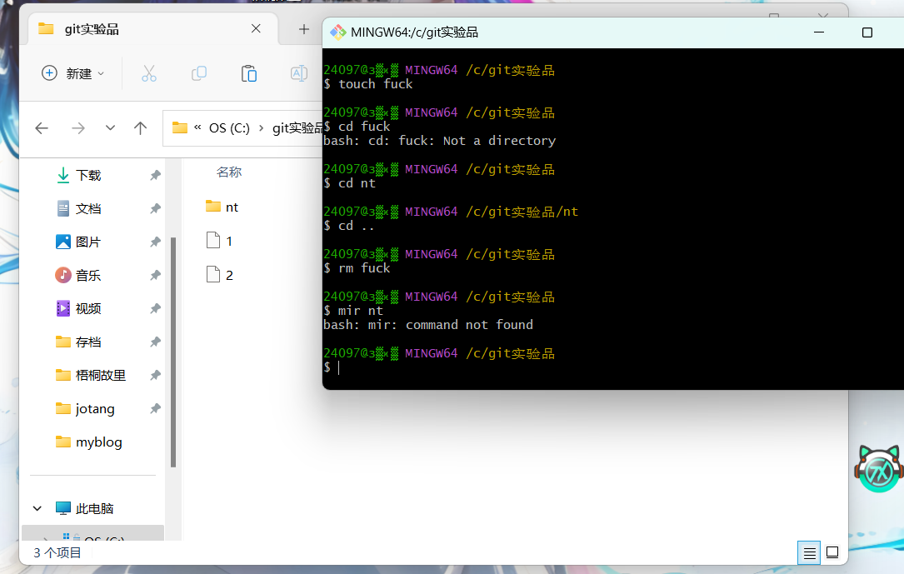
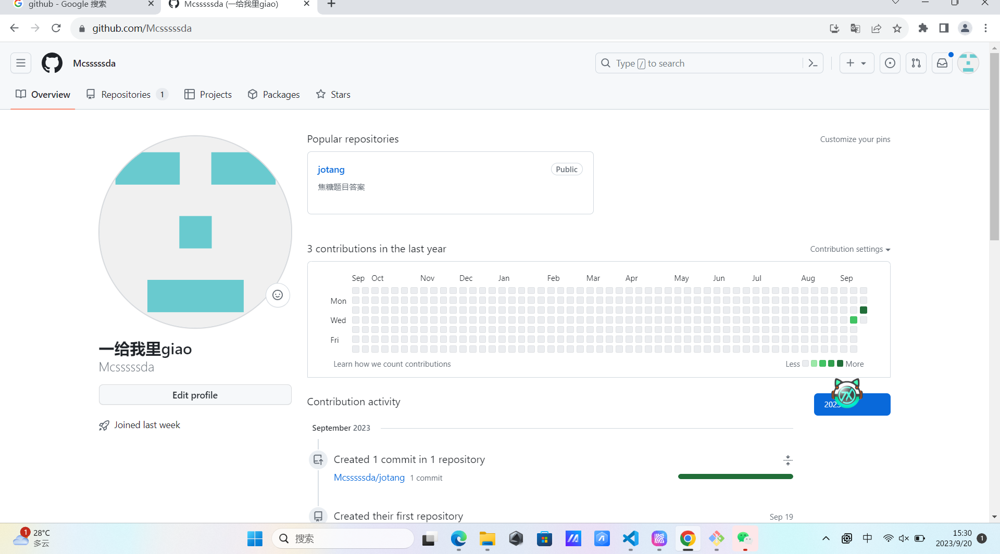
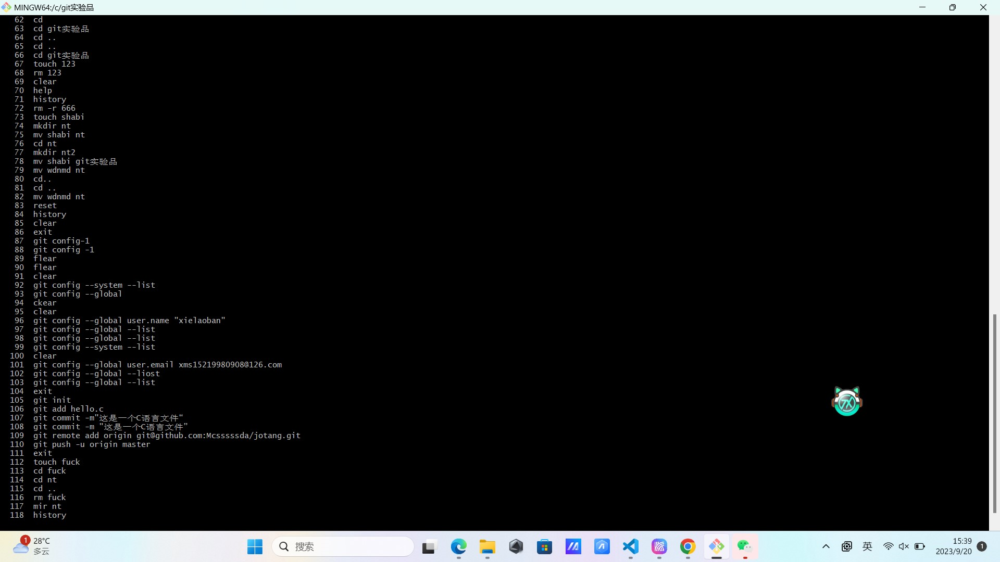
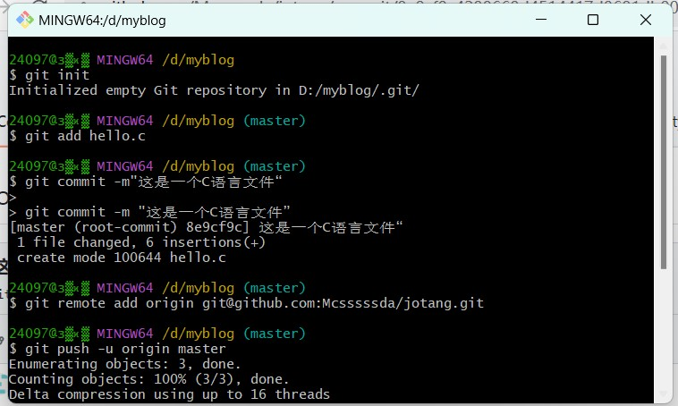
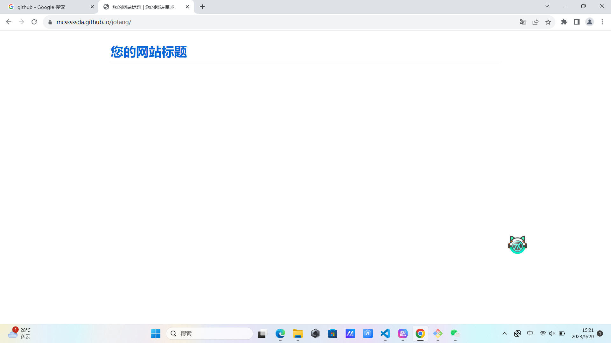
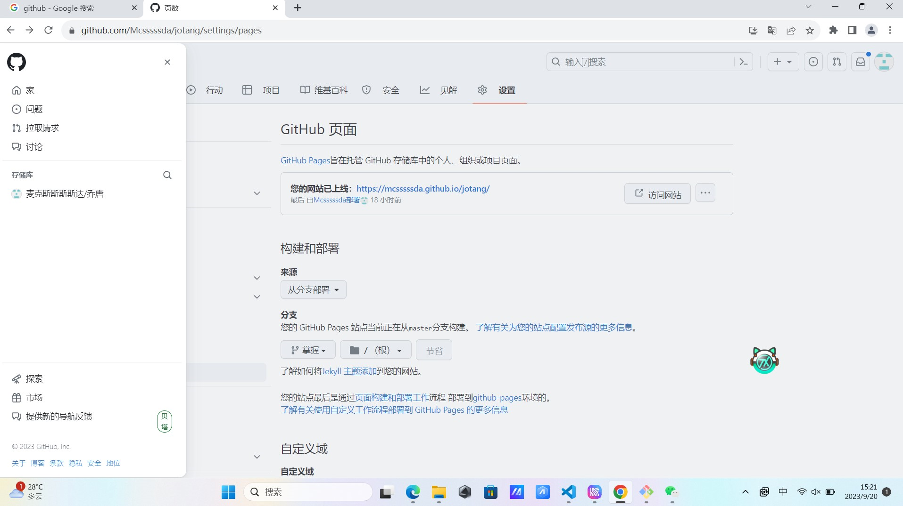

#尝试使用git以及通过git将本地文件上传至github远程仓库
首先下载安装git后自己尝试了一些简单的文件管理指令（记不住好多）

##科学上网，登入GitHub并且创造了属于自己的账号

#在git构建ssh密匙，通过git将本地仓库与GitHub远程仓库建立连接

#然后尝试通过git从本地上传文件至github远程仓库

#尝试构建自己的博客！从GitHub找到博客网站文件下载至本地然后通过git上传到GitHub
***但是最后出现了一点问题 我的博客最后构建出来后并没有应有的效果 我更换了博客文件进行了多次尝试 没有啥效果 有点郁闷 至今没有解决***

最后我的博客在这儿[链接](https://mcsssssda.github.io/jotang/)

### ***感想***
第一次接触计算机领域，亲自探索未知的领域进行学习和操作有一说一大大激发了我的好奇心，本身就对计算机这个领域有着神秘的期盼和向往，因此报了你电的软工。这次招新题目一学一尝试，我只能说我的好奇心和热爱都多多少少被激发出来了，虽说我的答案仍有不完美和不满意的地方，但我明白学习的过程磕磕碰碰不可能没有，我也只能坦然地面对，接受，然后改进。