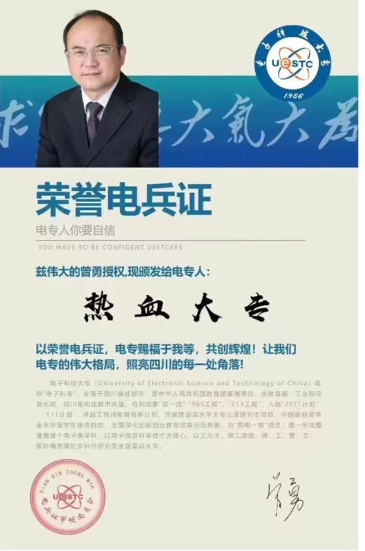

#第一次尝试使用Markdown  
## (接下来这段话是我最后加哒 这一块的内容是我第一次学习使用Markdown的原生态无污染记录，内容比较抽象)  
##二级标题  
这是正文哈哈哈  
真的换了一行
###三级标题  
这也是正文  
*尝试加粗*  
*额但是效果不明显*  
*它只是变斜了*  
**原来要两个星号才算加粗**  
**试试新插件markdown all in one**  
*ctrl i*会变斜  
**ctrl b**会变粗  
***ctrl i+b***又粗又斜  
 1. 哈哈哈  
 2. 自动编号了耶  
 1.哈哈哈  
 看来要自动编号需要在.后面空一格  
####试试新插件 装个图片试试  

***牛逼哈哈哈哈***  
再来一张
$$
\lim_{x\to\infin}\frac{sin(t)}{x-1}
$$
ctrl mm
$$

$$
快捷键
##表格
|小苹果|中苹果|大苹果|
|:---:|:---:|:---:|
1|23|33
红苹果|青苹果|绿苹果
原神|原砷|原始人

尝试下粘贴[链接](https://www.limfx.pro/ReadArticle/57/yi-zhong-xie-zuo-de-xin-fang-fa#%E5%85%AC%E5%BC%8F)
```c
#include <stdio.h>
int main()
{
printf("你玩原神吗?");
scanf("%s",str);
printf("原始人，启动！");
return 0;
}
``````
