# 建立虚拟机以及安装ubuntu  
## 第一步 寻找资源下载VMware  
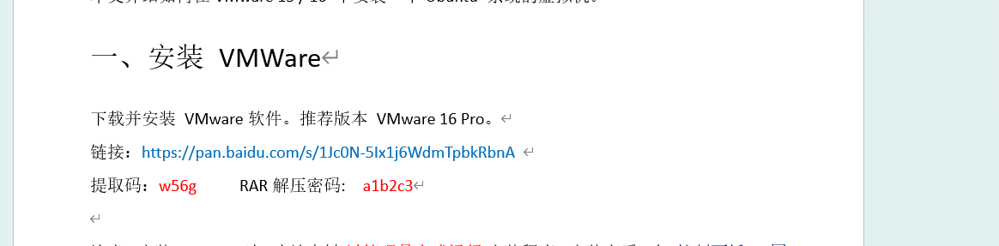
## 安装完成后打开，创建虚拟机  
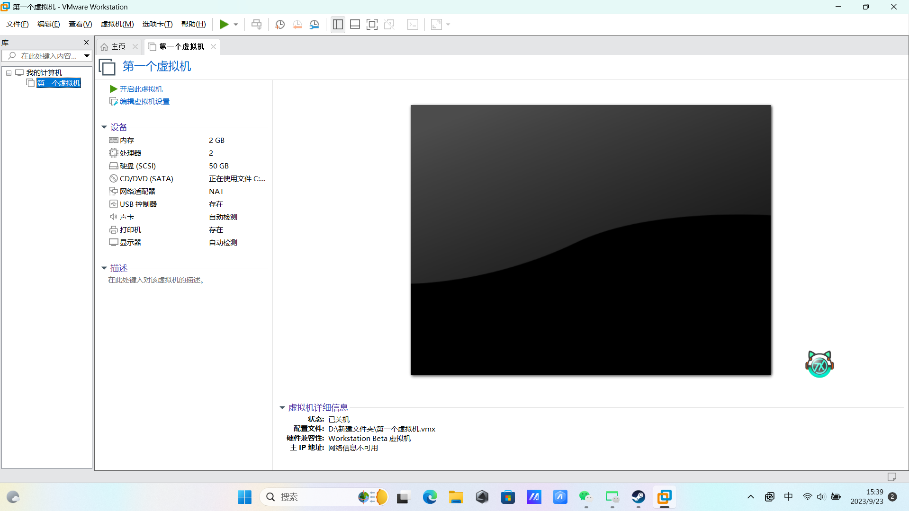
## 第二步 前往ubuntu官网下载安装ubuntu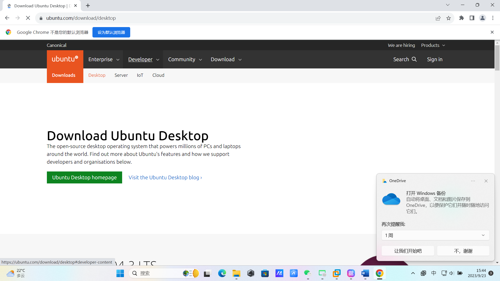
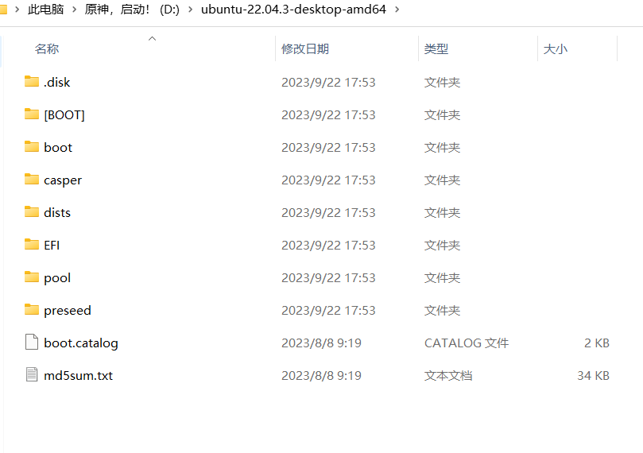
## 随后在vmware的虚拟机设置中更改设置，选择Ubuntu的光盘映像文件
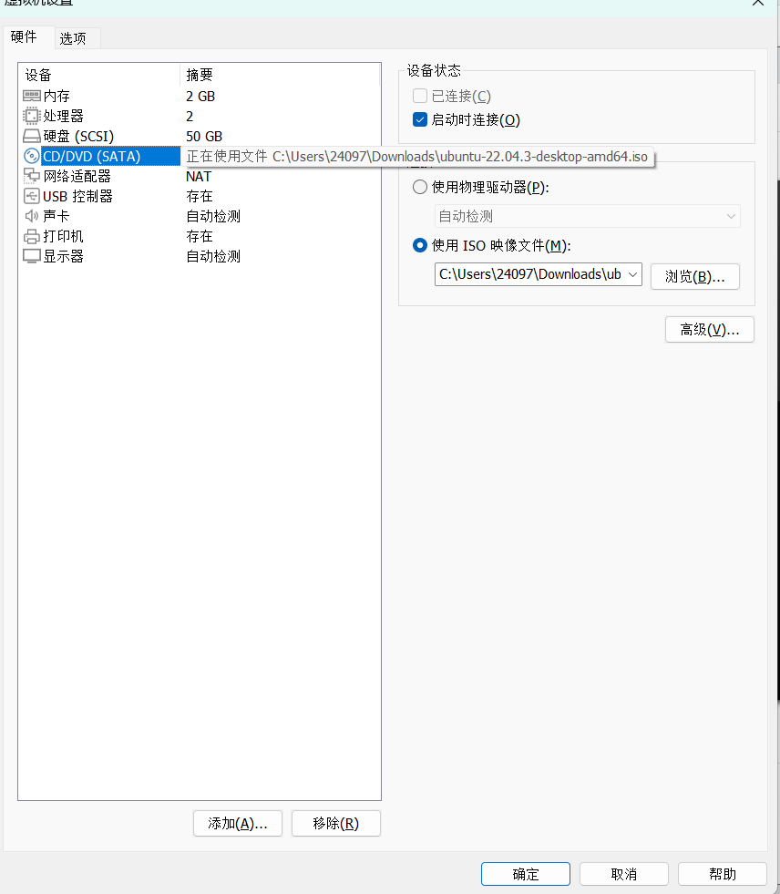
## 最后一步，启动虚拟机，大功告成！
### ***加分项1.用remote插件连接VScode和Ubuntu***
### 第一步 在vscode中下载remote development插件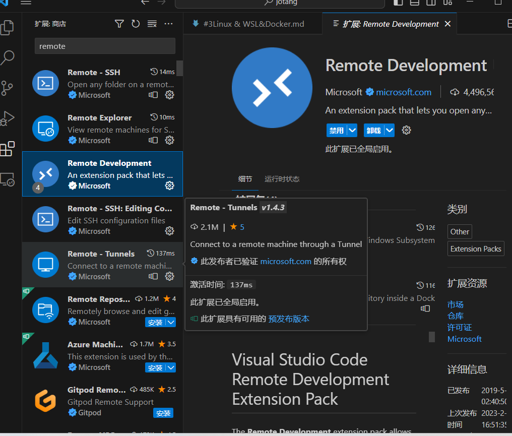
### 接下来，在ubuntu中获取地址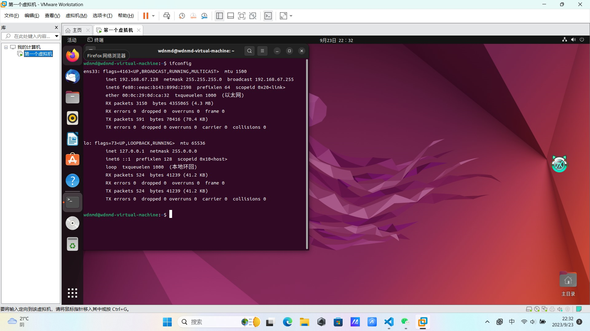
找到192.168.67.128
### 输入指令sudo apt-get install ssh安装ssh服务器

输入命令service ssh start
启动服务器运行
然后在remote control中点击新建远程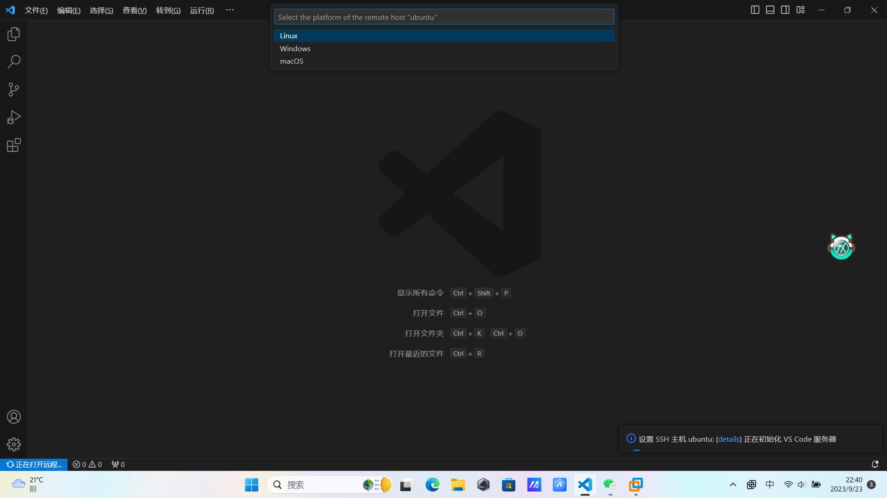
***并在设置中调试config文件***
输入IP地址以及用户名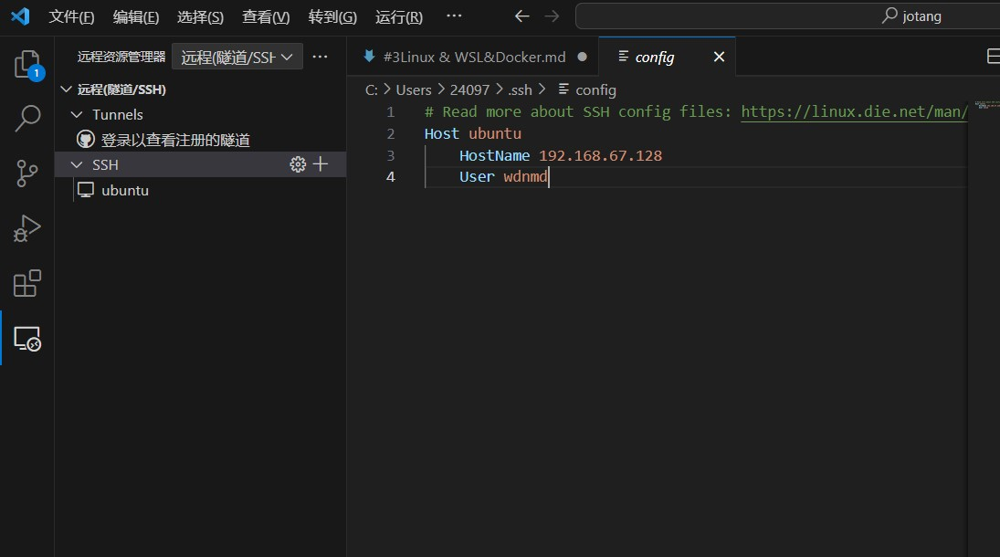
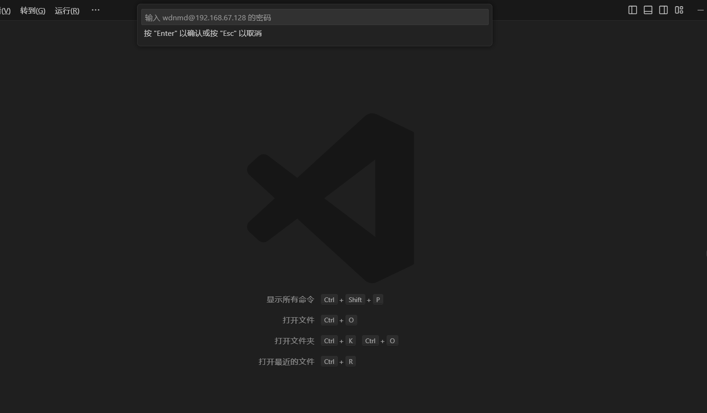
最后可以输入service ssh stop停止连接！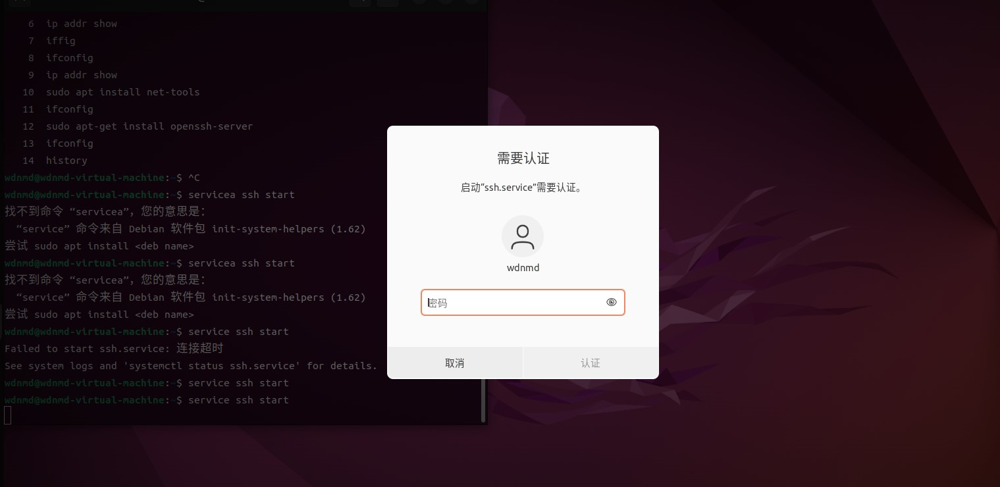
### ***加分项2.配置好基于ssh的远程服务器登录***
我选择在虚拟机中的ubuntu中配置远程服务器
首先，打开Ubuntu终端，输入ssh-keygen生成密匙!
容易得知，两个id_rsa中有后缀的那一个文件为公钥，另一个为私钥
然后输入命令cd .ssh进入文件夹，输入命令cat id_rsa打开文件，查看密匙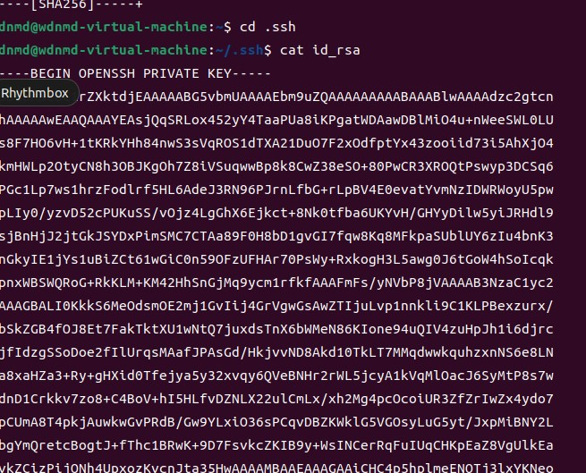
复制密匙，然后在终端输入sudo  apt install vim安装vim
再输入vim authorized keys打开文件，将复制的密匙输入进去至此ssh配置大致完成
最后，在命令界面输入service ssh start开启服务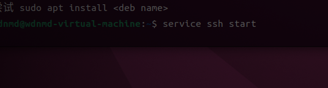
回到windows终端输入Ubuntu中ip地址和用户名，按提示键入密码即可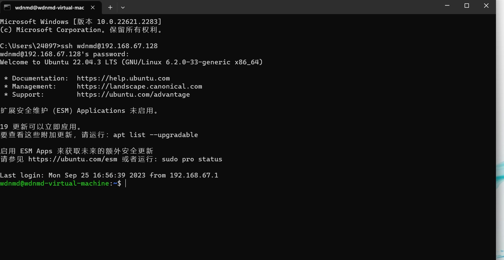
至此搭建远程服务器成功！~